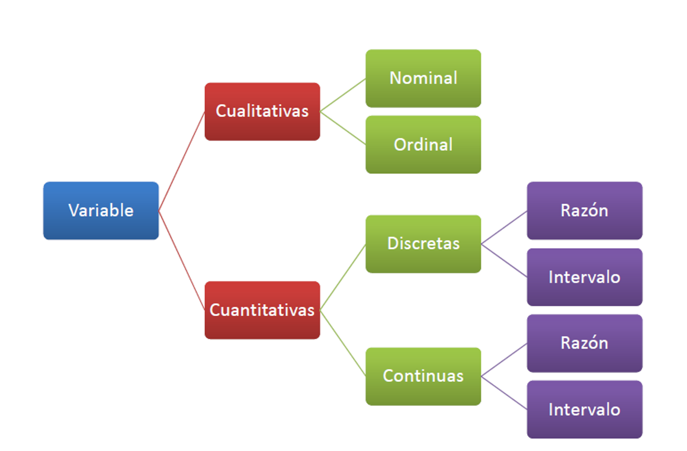
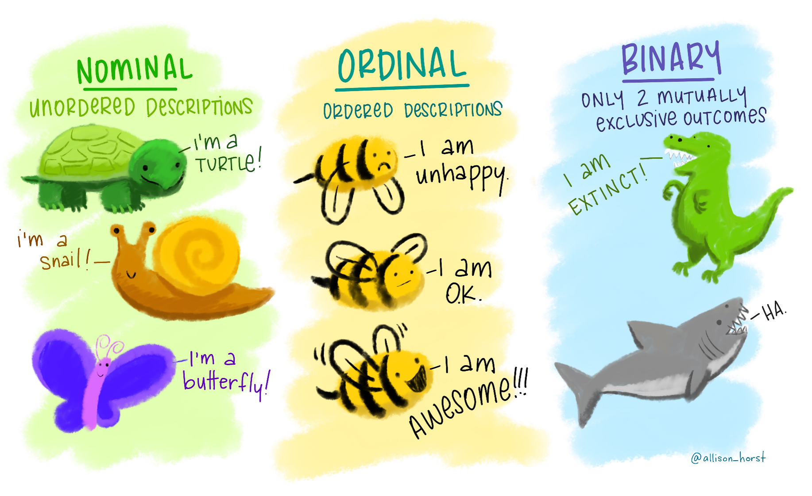
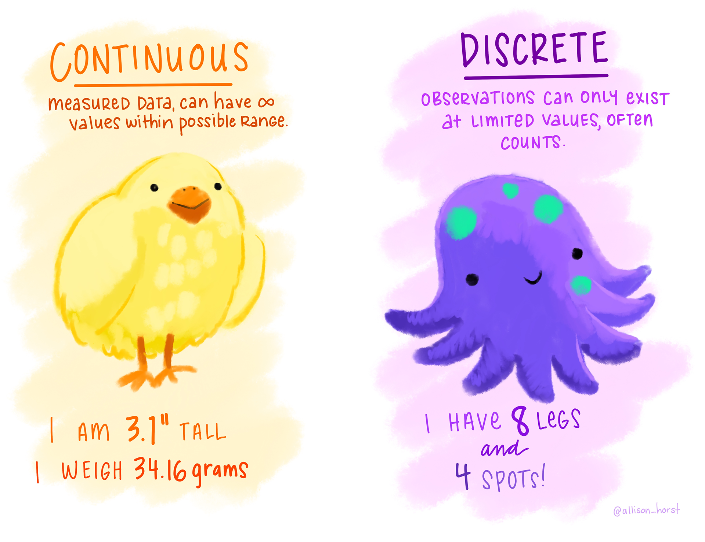

```{r}
library(pacman)

p_load(here)
```

\newcommand\norm[1]{\left\lVert#1\right\rVert}

## Tipos de variables

{fig-align="center" width="100%"}

## Tipos de variables

{fig-align="center" width="100%"}

<span style="font-size:0.7em; color:gray">Fuente: Allison Horst</span>

## Tipos de variables

{fig-align="center" width="100%"}

<span style="font-size:0.7em; color:gray">Fuente: Allison Horst</span>


## 🧪 Actividad: Identificación de variables

</br></br>

🎯 Objetivo:

- Identificar el **tipo de variable** (cualitativa / cuantitativa)
- Determinar su **subtipo** (nominal, ordinal, discreta, continua)
- Reconocer la **escala de medición** (nominal, ordinal, intervalo, razón)

## 🔬 Ejercicio 1 — Mediciones de laboratorio

Clasifique las siguientes variables:

1. Peso de una muestra (g)
2. Temperatura de una reacción (°C)
3. pH de una disolución
4. Concentración de un analito (mg/L)
5. Tiempo de reacción (min)


---

## 💊 Ejercicio 2 — Control de calidad

Identifique tipo y escala:

1. Tipo de envase (vidrio, plástico, ninguno)
2. Nivel de pureza del producto (bajo, medio, alto)
3. Número de tabletas defectuosas en un lote
4. Tiempo de vida útil del producto (días)
5. Presencia de contaminación microbiana (sí/no)

## 🌱 Ejercicio 3 — Biología y ecología

Clasifique:

1. Longitud de una hoja (cm)
2. Fuerza de adherencia de una raíz (escala 0–5)
3. Nivel de estrés hídrico (leve, moderado, severo)
4. Edad de un árbol (años)
5. Índice de biomasa
6. Grupo taxonómico (especie)

